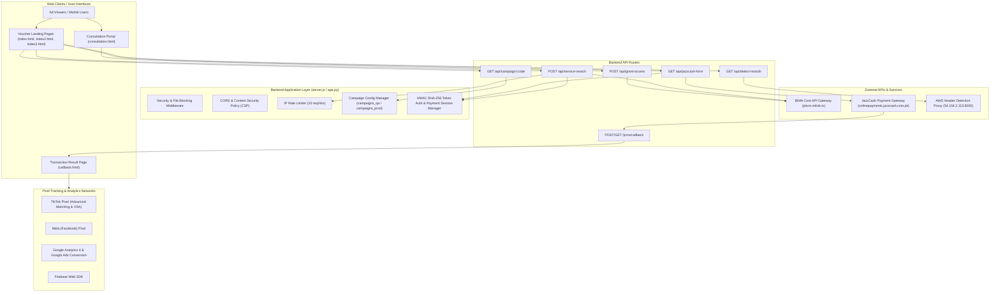
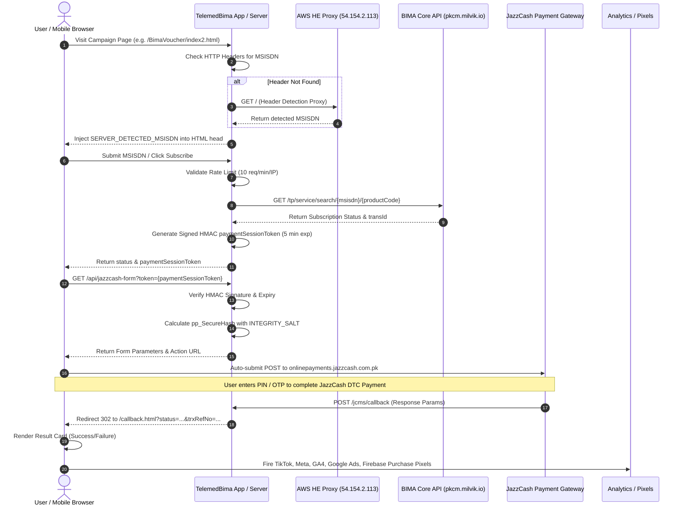
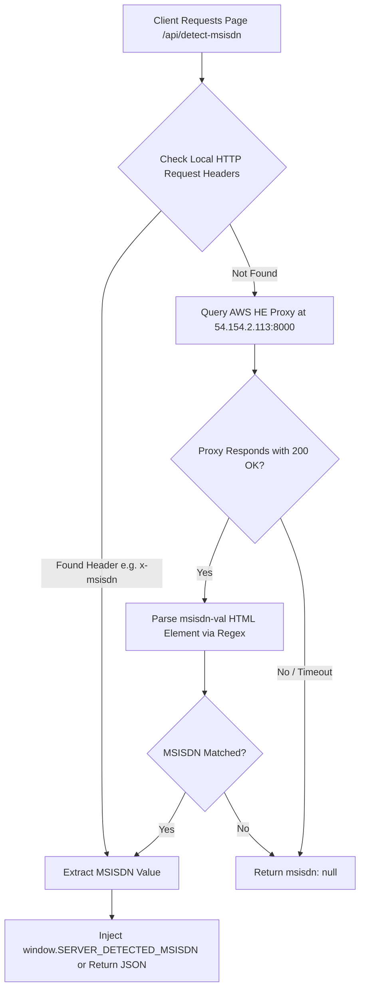
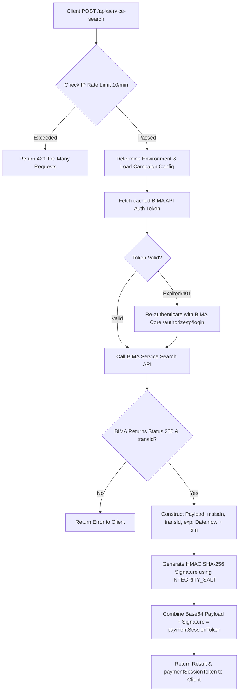
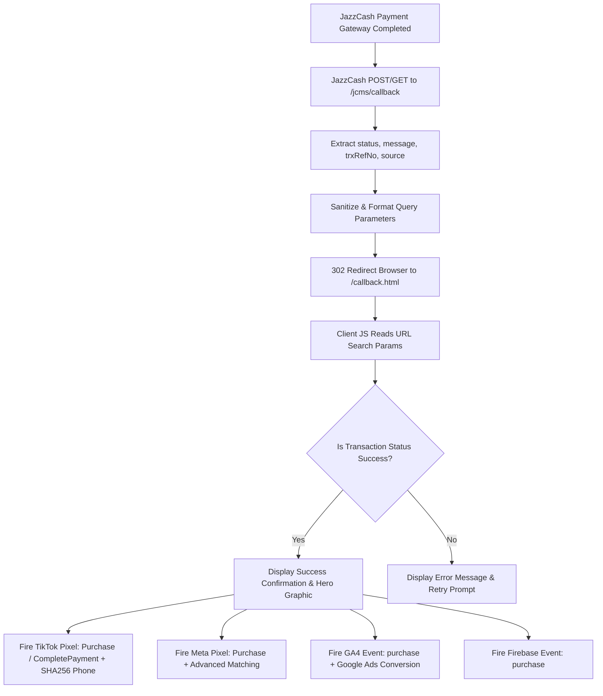
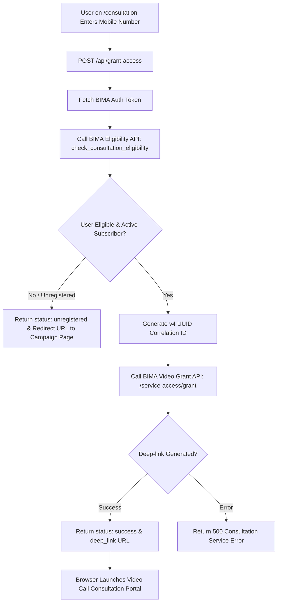
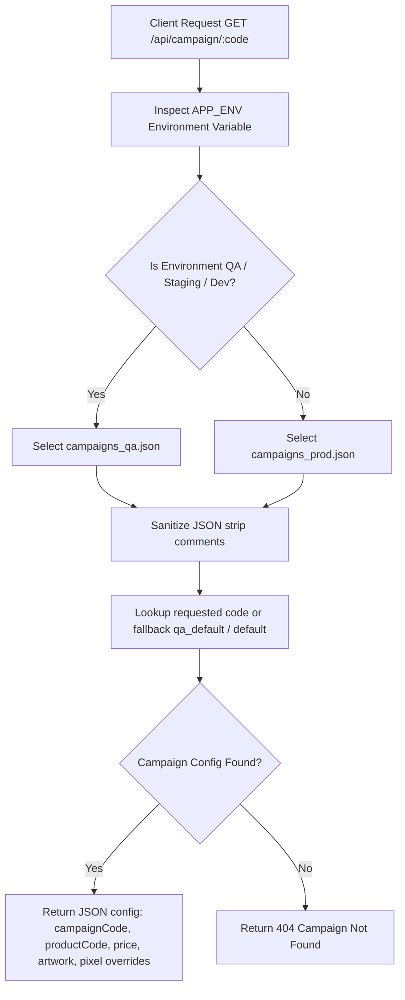

# TelemedBima / BIMA Health - System Flow Diagrams & Architecture Specifications

> [!NOTE]
> This document provides visual Mermaid flowcharts, sequence diagrams, and architecture specifications for the entire **TelemedBima / BIMA Health Campaign Platform** repository ([memory.md](file:///d:/web/telemedbima/memory.md)).

---

## 1. High-Level System Architecture & Component Interactions

This component diagram details the interaction boundaries between browser clients, Express.js (`server.js`) / Flask (`app.py`) application servers, internal security & rate-limiting middleware, BIMA Core APIs (`pkcm.milvik.io`), JazzCash Payment Gateway (`onlinepayments.jazzcash.com.pk`), AWS Header Enrichment proxy (`54.154.2.113:8000`), and analytics tracking pixels.

---

## 2. End-to-End User Conversion & DTC Payment Sequence

The sequence diagram below traces the complete lifecycle of a user clicking an ad, auto-detecting phone number via Mobile Header Enrichment (HE), initiating subscription search, securing payment session token, redirecting to JazzCash, returning to callback page, and triggering conversion tracking.

---

## 3. Mobile Network Header Enrichment (HE) MSISDN Auto-Detection

This diagram outlines how cellular mobile network headers (`x-msisdn`, `x-up-calling-line-id`, `msisdn`) are checked locally and forwarded to AWS Header Enrichment proxy (`54.154.2.113:8000`) for auto-filling subscriber numbers.

---

## 4. BIMA Service Search & Cryptographic Payment Session Flow

This flowchart illustrates rate-limiting checks, cached BIMA auth token handling, BIMA service search API calls, and signed HMAC SHA-256 `paymentSessionToken` generation (5-minute expiration window).

---

## 5. Payment Return Callback & Multi-Pixel Conversion Engine

This diagram details the post-payment redirection flow handled by `/jcms/callback` and how `callback.html` processes query strings to fire conversion events across TikTok, Meta, GA4, Google Ads, and Firebase.

---

## 6. Telemedicine 24/7 Doctor Consultation & Video Call Deep-Link Flow

This flowchart illustrates how subscribers verify eligibility via `/api/grant-access` and receive authorized video portal deep-links.

---

## 7. Dynamic Campaign Configuration & Selection Engine

This flowchart shows how backend servers determine environment mode (`APP_ENV`), inspect `campaigns_qa.json` vs `campaigns_prod.json`, strip comments, and serve dynamic campaign settings.

---

## 8. Diagram Update Protocol for Future Changes

> [!IMPORTANT]
> To ensure the flow diagrams remain continuously aligned with future changes, maintainers and AI assistants must follow this protocol:

1. **Adding Backend API Routes**:
   - Update **Diagram 1 (System Architecture)** with the new endpoint node.
   - Add a dedicated flowchart diagram if the route introduces multi-step asynchronous processing or external third-party API calls.

2. **Modifying Payment Gateway Logic**:
   - Update **Diagram 2 (Sequence)** and **Diagram 5 (Callback & Conversion)** if parameters, signature hashing, or return routes (`/jcms/callback`) are changed.

3. **Updating Conversion Tracking & Pixels**:
   - Update **Diagram 5 (Callback & Conversion)** when adding new pixel networks (e.g. Snapchat, Twitter/X, Pinterest) or updating SHA-256 hashed parameters.

4. **Updating BIMA Core Integration**:
   - Update **Diagram 4 (Service Search)** or **Diagram 6 (Telemedicine)** if authentication headers, grant UUID generation, or eligibility API endpoints change.

5. **Updating Memory Documentation**:
   - Whenever editing system logic, sync modifications into [memory.md](file:///d:/web/telemedbima/memory.md) under Section 9 (`System Flow Diagrams & Workflows`).
